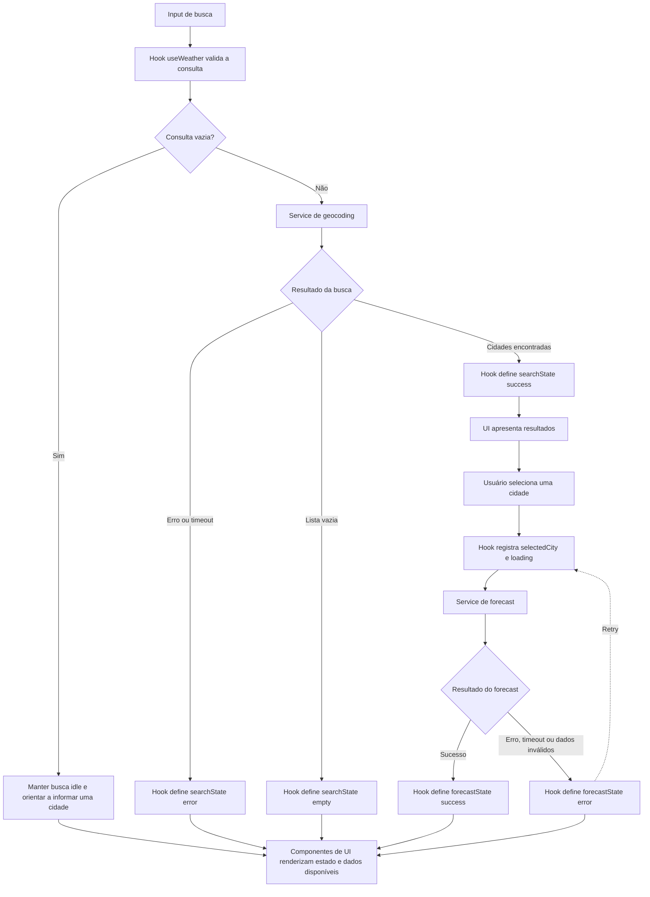

# Plano Técnico — Aplicação de previsão do tempo

## Architecture

Aplicação React de página única, sem backend próprio. A organização separa apresentação, orquestração/estado, I/O externo e funções puras. O fluxo segue uma direção: componentes → hook → serviços → Open-Meteo; serviços usam funções puras de `lib` para normalizar respostas.

```text
components (UI) → hooks (fluxo e estado) → services (HTTP/API)
                                     └── lib (mapeamentos e cálculos puros)
services ── Open-Meteo Geocoding API / Forecast API
```

- **Apresentação (`components`):** renderiza dados e estados por props; emite intenções do usuário por callbacks. Não faz fetch, conversão de unidade nem mantém estado de consulta compartilhado.
- **Orquestração (`hooks`):** coordena busca, seleção, carregamento paralelo de clima/previsão, cancelamento de respostas obsoletas e estado local. Não conhece detalhes do JSON externo.
- **Acesso a dados (`services`):** constrói URLs, executa `fetch`, trata status/timeout e valida o formato mínimo da resposta antes de delegar o mapeamento.
- **Funções puras (`lib`):** converte Celsius/Fahrenheit, mapeia códigos WMO, normaliza DTOs e datas; não importa React nem executa I/O.
- **Dependências em uma direção:** `components` consome `hooks`; `hooks` consome `services`; `services` consome `lib`. `lib` não depende das outras camadas.
- **Estado da aplicação:** estado local em hooks; sem biblioteca global para esta escala.
- **Persistência:** nenhuma persistência no servidor; preferência de unidade mantida apenas durante a sessão atual até decisão diferente.
- **Rastreabilidade:** busca e seleção atendem FR-1; consulta atual FR-2; previsão FR-3; unidade FR-4; layout e navegação móvel FR-5; estados de erro e vazio FR-6. NFR-1 a NFR-6 atravessam apresentação, serviços e contratos.

## Tech Stack

- **TypeScript strict:** compatível com a configuração atual; contratos explícitos para dados externos e estados da interface.
- **React 19:** já é dependência do projeto; composição da tela e estado local.
- **Vite:** servidor de desenvolvimento e build já configurados.
- **Tailwind CSS:** já configurado no projeto para estilos responsivos, com controles e estados focados em teclado.
- **Open-Meteo:** fonte aprovada na spec, sem chave de API; geocoding e forecast acessados diretamente pelo navegador.
- **Vitest + Testing Library:** dependências presentes para testes unitários e de componentes.
- **Playwright:** dependência e configuração presentes para validar o fluxo essencial em viewport móvel.
- **Biome:** lint e formatação já configurados.
- **Sem dependência adicional de estado ou cliente HTTP:** `fetch`, AbortController e estado React atendem o fluxo; adicionar uma biblioteca exigiria uma necessidade concreta não definida na spec.

## Project Structure

Estrutura proposta, respeitando as convenções documentadas do repositório e mantendo os quatro limites da arquitetura explícitos:

```text
src/
  components/
    WeatherApp.tsx
    CitySearch.tsx
    CityResults.tsx
    CurrentWeather.tsx
    ForecastList.tsx
    TemperatureUnitControl.tsx
  hooks/
    useWeather.ts
  services/
    geocoding.ts
    weather.ts
  lib/
    temperature.ts
    weatherCode.ts
    openMeteoMappers.ts
  types/
    weather.ts
tests/
  unit/
    services/
    lib/
    hooks/
  components/
  e2e/
```

- `WeatherApp` compõe o fluxo; componentes menores recebem valores e callbacks tipados.
- `useWeather` é dono do estado e chama funções de serviços. Testes de hook podem controlar as promessas dos serviços para verificar loading, vazio, erro, seleção e respostas obsoletas sem rede real.
- `services` isolam `fetch`; testes substituem/interceptam a rede e cobrem URL, status HTTP, timeout e parsing inválido.
- `lib` contém funções determinísticas; testes unitários passam entradas e comparam saídas, sem DOM, React ou mocks de rede.
- Testes de componentes cobrem renderização, teclado, labels e estados via Testing Library; E2E valida o fluxo integrado com endpoints interceptados pelo Playwright.
- Não criar backend, store global, cache compartilhado ou cliente HTTP genérico sem requisito que justifique. Confirmar a convenção efetiva de testes já usada no repositório antes de fixar nomes e subdivisões exatas.

## Data Model

Tipos internos independentes dos nomes e da estrutura da resposta Open-Meteo. Temperaturas são normalizadas para Celsius; a unidade escolhida afeta a apresentação, não os dados armazenados.

```ts
type Unit = "celsius" | "fahrenheit";

interface City {
  name: string;
  country?: string;
  countryCode?: string;
  latitude: number;
  longitude: number;
  region?: string;
  timezone?: string;
}

interface CurrentWeather {
  time: string;
  temperatureC: number;
  apparentTemperatureC?: number;
  relativeHumidityPercent?: number;
  precipitationMm?: number;
  weatherCode: number;
  isDay?: boolean;
  windSpeedKmh?: number;
  windDirectionDeg?: number;
}

interface ForecastDay {
  date: string;
  minTemperatureC: number;
  maxTemperatureC: number;
  weatherCode: number;
  precipitationSumMm?: number;
}

interface WeatherData {
  city: City;
  current: CurrentWeather;
  forecast: ForecastDay[];
}
```

- Temperaturas são normalizadas para Celsius; `Unit` controla somente apresentação. Velocidade do vento é normalizada para km/h e precipitação para mm.
- `City` inclui coordenadas necessárias ao forecast; os metadados geográficos são opcionais se não vierem no geocoding.
- Os códigos WMO permanecem numéricos no modelo; `lib/weatherCode.ts` fornece rótulos pt-BR.
- `ForecastDay` propõe mínima e máxima diárias. A escolha das variáveis a exibir permanece aberta na spec e precisa de confirmação do produto.
- Contratos dos serviços:

```ts
type Result<T> =
  | { ok: true; data: T }
  | { ok: false; error: WeatherServiceError };

interface WeatherServiceError {
  kind: "network" | "api" | "timeout" | "invalid-data";
  retryable: boolean;
  statusCode?: number;
}

searchCities(query: string, signal?: AbortSignal): Promise<Result<City[]>>;
getCurrentWeather(city: City, signal?: AbortSignal): Promise<Result<CurrentWeather>>;
getForecast(city: City, signal?: AbortSignal): Promise<Result<ForecastDay[]>>;
```

Assinaturas acima são contratos para orientar a implementação, não código final. As consultas de clima atual e previsão têm resultados independentes para permitir sucesso parcial. A busca vazia é validada antes de chamar o serviço; nenhum resultado é `ok: true` com lista vazia, não uma falha de serviço.

## Data Flow



O hook coordena as chamadas aos services e mantém os estados de busca e forecast; componentes de UI exibem esses estados sem fazer I/O. Uma consulta sem resultados é distinta de uma falha. O retry repete somente o forecast, e novas buscas/seleções ignoram respostas obsoletas. A unidade selecionada é aplicada ao renderizar os dados Celsius já armazenados, sem nova requisição.

## External APIs

### Geocoding — Open-Meteo

- **URL de exemplo:** `https://geocoding-api.open-meteo.com/v1/search?name=Lisbon&count=10&language=pt&format=json`
- **Parâmetros:** `name` é a busca; `count` limita resultados; `language=pt` solicita nomes localizados quando disponíveis; `format=json` define a representação da resposta.
- **Resposta resumida:**

```json
{
  "results": [
    {
      "name": "Lisbon",
      "latitude": 38.7167,
      "longitude": -9.1333,
      "timezone": "Europe/Lisbon",
      "country": "Portugal",
      "country_code": "PT",
      "admin1": "Lisbon"
    }
  ]
}
```

- **Mapeamento para `City`:** `name`, `latitude`, `longitude` e `timezone` mapeiam diretamente; `country_code` → `countryCode`; `admin1` → `region`. `country`, código, região e fuso podem não estar disponíveis. Ausência de resultados é uma lista vazia, não erro.

### Forecast — Open-Meteo

- **URL base:** `https://api.open-meteo.com/v1/forecast`. Fazer consultas atual e diária separadas permite falhas parciais independentes.
- **Consulta atual:**

```text
https://api.open-meteo.com/v1/forecast?latitude=38.7167&longitude=-9.1333&current=temperature_2m,apparent_temperature,relative_humidity_2m,is_day,precipitation,weather_code,wind_speed_10m,wind_direction_10m&timezone=auto&temperature_unit=celsius&wind_speed_unit=kmh&precipitation_unit=mm
```

- **Consulta diária:**

```text
https://api.open-meteo.com/v1/forecast?latitude=38.7167&longitude=-9.1333&daily=weather_code,temperature_2m_min,temperature_2m_max,precipitation_sum&forecast_days=5&timezone=auto&temperature_unit=celsius&wind_speed_unit=kmh&precipitation_unit=mm
```

- `latitude`/`longitude` vêm de `City`; `current` enumera variáveis atuais; `daily` enumera variáveis diárias; `forecast_days=5` solicita hoje e os quatro dias seguintes; `timezone=auto` associa as datas civis ao fuso da localização. Os parâmetros de unidades fixam Celsius, km/h e mm para o modelo.
- **Resposta resumida:**

```json
{
  "timezone": "Europe/Lisbon",
  "current": {
    "time": "2026-10-07T12:00",
    "temperature_2m": 21.4,
    "apparent_temperature": 21.0,
    "relative_humidity_2m": 58,
    "is_day": 1,
    "precipitation": 0.0,
    "weather_code": 2,
    "wind_speed_10m": 12.5,
    "wind_direction_10m": 240
  },
  "daily": {
    "time": ["2026-10-07", "2026-10-08"],
    "temperature_2m_min": [16.2, 15.8],
    "temperature_2m_max": [22.1, 21.7],
    "weather_code": [2, 3],
    "precipitation_sum": [0.0, 1.2]
  }
}
```

- **Mapeamento para `CurrentWeather`:** `current.time` → `time`; `temperature_2m` → `temperatureC`; `apparent_temperature` → `apparentTemperatureC`; `relative_humidity_2m` → `relativeHumidityPercent`; `precipitation` → `precipitationMm`; `weather_code` → `weatherCode`; `is_day` (`0`/`1`) → `isDay` (`false`/`true`); `wind_speed_10m` → `windSpeedKmh`; `wind_direction_10m` → `windDirectionDeg`.
- **Mapeamento para `ForecastDay[]`:** os arrays `daily` são paralelos; para cada índice `i`, `time[i]` → `date`, `temperature_2m_min[i]` → `minTemperatureC`, `temperature_2m_max[i]` → `maxTemperatureC`, `weather_code[i]` → `weatherCode` e `precipitation_sum[i]` → `precipitationSumMm`.
- Juntar `City`, `CurrentWeather` e a lista `ForecastDay[]` em `WeatherData`. Datas são strings de data civil, sem conversão para timestamp local do navegador. `weatherCode` mantém o código WMO; o rótulo pt-BR vem de função pura.
- Validar cinco datas e comprimentos consistentes dos arrays. Não fabricar dados ausentes; reportar falha da seção correspondente. A Open-Meteo não exige API key; confirmar cobertura, limites e condições de uso antes da entrega.

## State Management

O estado do fluxo vive no hook `useWeather`, consumido pelo componente de página e distribuído como props. Componentes de apresentação não fazem fetch nem mantêm cópias dos resultados; só podem manter estado efêmero de interação que não afete outras seções. Não usar store global, Context global ou persistência nesta versão.

Contrato conceitual comum dos estados assíncronos:

```ts
type AsyncState<T> =
  | { status: "idle" }
  | { status: "loading" }
  | { status: "success"; data: T }
  | { status: "empty" }
  | { status: "error"; error: WeatherServiceError };
```

- `query`: texto digitado para a busca.
- `searchState: AsyncState<City[]>`: `idle` antes da busca; `loading` durante a chamada; `success` com resultados; `empty` quando a chamada foi bem-sucedida mas não encontrou cidades; `error` quando a busca falhou.
- `selectedCity: City | null`: cidade confirmada pelo usuário; selecionar uma cidade inicia as consultas meteorológicas.
- `currentState: AsyncState<CurrentWeather>` e `forecastState: AsyncState<ForecastDay[]>`: estados independentes, cada um com `idle`, `loading`, `success` ou `error`. `empty` não é usado para payload meteorológico vazio/incompleto; esse caso é erro de dados inválidos, pois o produto espera condições e cinco dias.
- `unit: Unit`: inicia em `celsius`; permanece apenas em memória durante a sessão.

### Conversão de unidade

O modelo guarda valores canônicos em Celsius. Durante a renderização, componentes derivam os valores exibidos a partir de `CurrentWeather`/`ForecastDay` e `unit`; conversão em `lib/temperature.ts` usa $F = C \times 9/5 + 32$ e a conversão inversa quando necessária. A escolha de unidade não atualiza estado meteorológico, não modifica a resposta guardada e não dispara request. Ao alternar a unidade, re-renderizar os valores atuais, mínima/máxima e rótulos de unidade, mantendo cidade e datas.

Cada busca/seleção deve ignorar respostas obsoletas; `AbortController` pode cancelar chamadas anteriores. Cancelamentos causados por uma consulta mais recente não são erros visíveis. Estados de carregamento e resultado da busca devem ser distinguidos para que resultados antigos não sejam confundidos com a nova consulta.

## Error Handling

- **Entrada vazia:** validar antes do serviço, manter busca em `idle` e orientar a pessoa a informar uma cidade; não representar isso como falha.
- **Sem resultados:** resposta válida do geocoding com lista vazia vira `searchState.status = "empty"`; oferecer edição da consulta.
- **Rede:** falha de conexão/DNS ou `fetch` rejeitado vira `kind: "network"`; manter consulta editável e oferecer retry manual.
- **API:** resposta HTTP não bem-sucedida ou erro explícito retornado pelo provedor vira `kind: "api"`; guardar `statusCode` quando disponível, sem expor detalhes internos ao usuário.
- **Timeout:** aplicar limite de espera às chamadas; timeout vira `kind: "timeout"`. Separar de cancelamento intencional por troca de cidade, que deve ser ignorado.
- **Resposta inválida ou incompleta:** JSON malformado, campos essenciais ausentes, arrays diários desalinhados ou menos de cinco dias vira `kind: "invalid-data"`. Não fabricar valores nem associar resposta à cidade errada.
- **Resposta parcial:** clima atual e previsão têm estados independentes. Se uma chamada tiver sucesso e a outra falhar, apresentar a seção válida e erro/retry apenas na seção que falhou; não transformar ambas em erro nem ocultar o sucesso.
- **Retry:** ação manual para a operação/seção com erro; não fazer retry automático nesta versão. Enquanto repete, somente o estado correspondente volta a `loading`.
- **Feedback acessível:** anunciar estados e mensagens relevantes sem depender apenas de cor; preservar foco e navegação por teclado.
- **Cache:** não implementar cache nem apresentar dados antigos como atuais; o comportamento de cache permanece fora da decisão atual.

## Testing Strategy

- **Vitest — funções puras em `lib`:** conversão Celsius↔Fahrenheit (incluindo valores negativos e decimais), formatação e rótulo da unidade, mapeamento de códigos WMO, conversão de `is_day` 0/1 e normalização de datas sem deslocamento de fuso. Esses testes não usam DOM nem rede.
- **Vitest — services com `fetch` mockado:** conferir URL e parâmetros de geocoding/current/daily; mapear respostas válidas; tratar busca vazia; status HTTP não OK/erro do provedor; rejeição de rede; timeout; JSON inválido; campos ausentes; arrays diários desalinhados ou com menos de cinco datas. Verificar também propagação/cancelamento por `AbortSignal` sem converter cancelamento intencional em erro visível.
- **Vitest + Testing Library — componentes:** renderizar explicitamente `idle`, `loading`, `success`, `empty` e `error` para busca; `idle`, `loading`, `success` e `error` para clima atual e previsão; verificar resultados com contexto geográfico, ausência de resultados, mensagens e retry, atualização da unidade sem nova consulta, falha parcial e navegação por teclado/labels acessíveis.
- **Vitest — hook `useWeather`:** controlar services assíncronos para verificar transições de estado, seleção de cidade, chamadas paralelas, independência de current/forecast, respostas obsoletas e retry localizado. Não testar detalhes de renderização aqui, que pertencem aos testes de componente.
- **Playwright — E2E:** cobrir busca por cidade, desambiguação e seleção, exibição de clima atual e cinco datas, mudança Celsius/Fahrenheit, busca sem resultados, erro recuperável e falha de apenas uma seção preservando a outra. Interceptar as APIs para ter dados determinísticos e exercitar fluxos completos sem depender da disponibilidade externa.
- **Playwright — viewport mobile:** executar o fluxo essencial em viewport móvel retrato; confirmar acesso à busca/resultados, leitura de clima atual e previsão, controles sem corte/overflow e interação por teclado quando aplicável. Manter pelo menos um cenário E2E de desktop se esse suporte for confirmado como requisito.
- **Rastreabilidade:** vincular casos aos critérios US-1 a US-6 e aos NFR de responsividade, acessibilidade e resiliência; usar Vitest para lógica/estados locais e Playwright para contratos integrados e layout real.
- **Comandos do projeto:** `pnpm test`, `pnpm test:e2e`, `pnpm lint` e `pnpm build`, conforme as fases de implementação e validação.

## Risks & Trade-offs

- **Representação da temperatura diária:** mínimas e máximas são a proposta para o contrato; a spec não define quais variáveis exibir. Confirmar com produto antes de fechar os campos visíveis.
- **Acesso direto à Open-Meteo, sem backend ou chave:** reduz infraestrutura e gestão de credenciais; alternativa considerada: backend intermediário, que centralizaria cache/limites mas adicionaria deploy e operação sem necessidade aprovada.
- **Sem cache nesta versão:** evita exibir informação antiga como atual e mantém a implementação pequena; alternativa: cache em memória/local, que pode melhorar resiliência e reduzir requests, mas exige política de expiração e indicação de frescor. Offline permanece fora de escopo.
- **Estado local em hooks:** simples para um único fluxo/tela; alternativa: store global (Context/Redux ou similar), útil se múltiplas áreas compartilharem estado ou houver persistência/favoritos, requisitos que não existem na spec.
- **Unidade convertida na apresentação:** mantém Celsius como representação canônica e impede divergência entre atual/previsão; alternativa: solicitar Fahrenheit à API ou armazenar valores duplicados, que acoplaria estado e requests à preferência e aumentaria risco de inconsistência.
- **Duas consultas Forecast independentes:** permitem sucesso parcial e retry por seção; alternativa: uma única chamada combinada reduz requests, mas acopla disponibilidade das duas áreas e dificulta retry isolado.
- **Vitest + Testing Library e Playwright:** unit/component tests são rápidos para lógica e estados; E2E fica reservado aos fluxos integrados e viewport real. Alternativa de testar tudo via E2E seria lenta e frágil; alternativa de somente unit tests não detectaria problemas de integração/layout móvel.
- **Sem camada genérica de cliente HTTP:** `fetch` encapsulado nos services é suficiente neste escopo; adicionar cliente/library só se surgir necessidade de interceptors, retry/políticas comuns ou mais provedores.
- **Fuso e datas:** `timezone=auto` associa previsão ao local, mas datas devem continuar como datas civis sem conversão para fuso do navegador. Confirmar formatação regional e testar limites de dia.
- **Metas de acessibilidade e dispositivos:** requisito atual é qualitativo; cobrir teclado e viewport móvel, e acordar matriz/metas antes de prometer conformidade mensurável.
- **Resultados geográficos homônimos:** nomes de região podem faltar; exibir todo contexto disponível e permitir escolha explícita, sem presumir unicidade do nome.